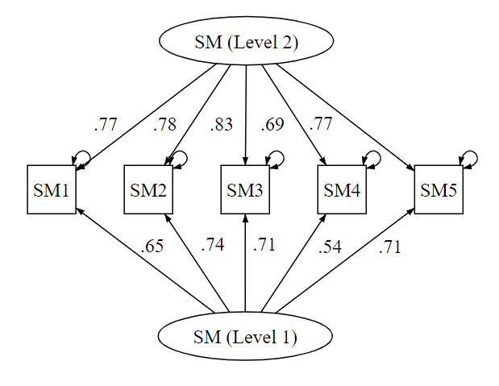

For clustered, multilevel, or hierarchical data, e.g., people nested with groups, or repeated measurement nested within people, the data violates the general assumption of “independence of observations” for many statistical procedures. To account for the nested structure for the data, specialized methods including HLM, Multilevel SEM, etc. have been developed.\
多層次資料(如個人鑲嵌於團體，或縱貫性研究中重複測量鑲嵌於個人)因違反一般統計工具「獨立性」的假設，通常較適合以專門的工具處理，如階層線性模型(HLM)。

Confirmatory Factor Analysis(CFA) is a useful tool for assessing scale reliability & validity. CFA can be extended into the clustered, multilevel, or hierarchical conditions, and here are some tools I use.\
驗證性因素分析常用來檢驗測量工具的信效度。本文中我將介紹幾個將CFA運用於多層次統計資料的工具。

­

## The Data 資料

The data is from an experience sampling method (ESM) study, where participants responded to the same scale multiple times. The scale consists of five items, here denoted as SM1 to SM5, and is by design a single factor scale. Factor “SM (Level 1)” is for within participant (co)variations (across time), while “SM (Level 2)” is for between participant (co)variations.\
此為經驗取樣法研究資料，參與者對同一份測量工具作答多次。此量表包含SM1到SM5共五個題目，且根據設計為單因素的量表。「SM (Level 1)」代表個體內(隨時間)的變異，「SM (Level 2)」則代表個體間的變異。




## Running the Model

```r
library(lavaan)
model.1 <- 'level: 1
            SML1 =~ SM1+SM2+SM3+SM4+SM5
            level: 2
            SML2 =~ SM1+SM2+SM3+SM4+SM5'
mcfa_fit <- cfa(model.1, data = dta, std.lv = T, cluster ="id")
summary(mcfa_fit, rsquare = TRUE)
```

For the model, refer to Huang ([2017](http://faculty.missouri.edu/huangf/data/mcfa/MCFAinRHUANG.pdf), [2018](https://francish.netlify.app/post/multilevel-cfa-mlf/)). Also, don’t forget to assess model fit.


## Reliability Indices (2 levels seperately)

```r
library(semTools)
reliability(mcfa_fit )  # omega=CR, avevar=AVE
```

For package semTools, refer to Jorgensen, T. D., Pornprasertmanit, S., Schoemann, A. M., & Rosseel, Y. ([2021](https://cran.r-project.org/package=semTools)). This method produces Alpha, CR, and AVE for Level 1 and Level 2 factors seperately.


## Reliability Indices (2 levels together)

```r
multilevel_alpha <- function(data, id, nsim = 5000, conf_level = .95, se = "robust.huber.white",
                             pa_args = list(fa = "pc"), ...) {}
multilevel_alpha(dta[rows of item], dta[,row of id])
```

For the multilevel_alpha function, refer to [Mark H. C. Lai](https://quantscience.rbind.io/) ([2020a](https://doi.org/10.1037/met0000287), [2020b](https://quantscience.rbind.io/publication/lai2020pm/)). Beware the data should be numeric. This method produces Alphas and CRs, for both the within (alphaw & omegaw) and between (alphab & omegab) portion of variance/covariance, as well as a Alpha and a CR (Omega) that accounts for variance/covariance at both the within and between levels. See Geldhof et al. ([2014](https://doi.org/10.1037/a0032138)) for discussion.