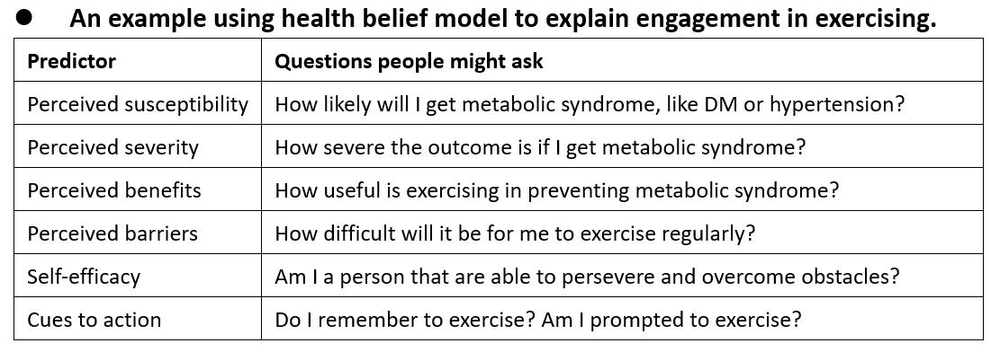

The health belief model is a conceptual model developed by a group of behavioral scientists working at the US Public Health Services to try to explain the (non-)utilization of TB screening services and is later applied to other health behaviors like vaccination or adherence to prescriptions (Rosenstock, [1974](https://doi.org/10.1177/109019817400200403)). The initial version states that the likelihood of an individual engaging in health-promoting behaviors is determined by four factors: perceived susceptibility & perceived severity of the disease, plus perceived benefits & perceived barriers of engaging in that behavior. In later developments, individual’s self-efficacy and external cues to action are also added to the model as predictors of health behavior (Green et al., [2021](https://doi.org/10.1002/9781119057840.ch68)). According to a recent meta-analysis (Carpenter, [2010](http://dx.doi.org/10.1080/10410236.2010.521906)), perceived benefits and barriers are the strongest predictor of health behavior, while perceived severity is a weaker predictor, and there’s little support for perceived susceptibility as health behavior predictor (this pattern is quite similar to the technology acceptance model).

